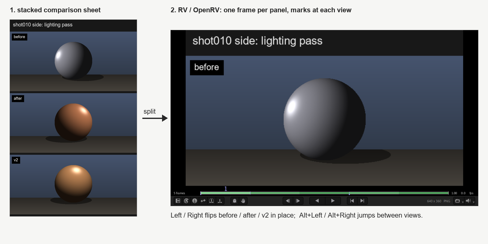

# tvr-skills-rv: RV and OpenRV review skills for Claude Code

A Claude Code plugin of Agent Skills for media review in RV: OpenRV and Autodesk RV /
ShotGrid RV. Claude puts renders, comparison sheets, movies and image sequences into one RV
window as a labelled flipbook for image and video review, A/B compares versions with a wipe
or difference, and checks the result, like a small dailies session on your own desktop.
Companion skills drive RV's command-line tools: rvio, rvls and rvpkg.

[](https://github.com/nzanepro/tvr-skills-rv/actions/workflows/tests.yml)



*A synthetic lighting-pass sheet (left) becomes one RV frame per version (right). Left / Right
flips versions in place; the timeline marks jump between views.*

## Skills

| Skill | What it does |
|---|---|
| [`rv-review`](rv-review/SKILL.md) | Loads stills, stacked comparison sheets, movies, image sequences, multi-view / stereo EXRs and 360 lat-long images into one RV review window, and verifies the load |
| [`rvio`](rvio/SKILL.md) | Convert image sequences to movies and back with rvio: EXR / OpenEXR, DPX, TIFF, PNG, JPEG, MOV / MP4; resize, crop, frame ranges, fps, audio, colour (sRGB, log, ACES, LUTs, baked OCIO), slates, frame burn-ins, watermarks |
| [`rvls`](rvls/SKILL.md) | List image sequences and find missing frames with rvls: frame ranges, gaps, resolution, bit depth, codec, timecode and full file headers; checks that a render or conversion is complete |
| [`rvpkg`](rvpkg/SKILL.md) | Install, uninstall and opt in to RV packages (.rvpkg plugins) with rvpkg; list what is installed and loaded, and set up support areas |

The rest of this README describes `rv-review`.

## Review renders in RV with Claude

### What it does

- **Panels, not sheets.** A stacked sheet (several renders of one view, one above the other,
  each with a label) is split into one frame per panel, so stepping frames flips versions on
  the same camera.
- **Labels on every frame**, all frames the same size, everything in one session with a
  timeline mark at the start of each view or source.
- **Any review media**: stills, movies, image sequences (`shot.1001-1100#.exr`), per-source
  in / out, wipe / difference / tile comparisons, multi-view EXRs (one view, or one frame per
  view), stereo pairs from any two views, and a 360 view for lat-long images.
- **One window.** If the review window is still open, the next review replaces its contents
  instead of opening another one.
- **Verified.** The launcher reads RV's state back (sources, frames, marks, view, stereo mode)
  and reports any difference instead of assuming the load worked.

**Use it for:** render review and look-dev in VFX, animation and games; lighting and
compositing versions; playblasts and turntables; A/B compare with wipe or difference;
image sequences in EXR / OpenEXR, DPX, TIFF, PNG or JPEG; MOV and MP4 movies; stereo and
multi-view EXRs; 360 / VR equirectangular (lat-long) images. It talks to RV through rvpush,
so it works with OpenRV and with Autodesk RV / ShotGrid RV.

### How it works

1. The agent collects the sheets or media in viewing order.
2. `sheet_panels.py split` cuts stacked sheets into labelled, equal-size frames and writes
   `frames.json` (frame paths plus the first frame of every view).
3. `rv_review.py` finds RV, then replaces the contents of the running review window through
   `rvpush set`, or launches a new RV detached with networking on.
4. It sets the layout, stereo mode, views and marks with `rvpush py-exec`, and reads the state
   back with `rvpush py-eval-return`; on a mismatch it retries once.
5. The agent reports what is loaded, where each view starts, and the keys.

## Requirements

| Need | Check |
|---|---|
| RV or OpenRV with `rv` and `rvpush` (see [See also](#see-also) for building OpenRV) | `rv -help` (Windows: `rv.exe -help`) |
| Python 3.10 or later | `python --version` |
| numpy and Pillow, for splitting sheets | `python -c "import numpy, PIL"` |
| A local desktop session (RV opens a window) | |

The launcher itself uses only the Python standard library and runs on Windows, macOS and Linux.

### How the launcher finds RV

First match wins; `rvpush` must be in the same folder as `rv`.

| Order | Where | Notes |
|---|---|---|
| 1 | `--rv-bin DIR` | folder holding rv and rvpush, or the rv executable itself |
| 2 | `RV_BIN` | this project's own variable, same meaning |
| 3 | `RVPUSH_RV_EXECUTABLE_PATH` | rv executable that rvpush would start; ignored when `none` (OpenRV `src/bin/apps/rvpush/RvPusher.cpp`, [rvpush manual](https://aswf-openrv.readthedocs.io/en/latest/rv-manuals/rv-user-manual/rv-user-manual-chapter-eighteen.html)) |
| 4 | `RV_PATH` | rv executable; the convention RV's Nuke integration reads (`rvNuke.py`) |
| 5 | `RV_APP_RV` | set by RV for the processes it starts (OpenRV `src/bin/apps/rv/main.cpp`) |
| 6 | `RV_HOME` | install root, rv in `RV_HOME/bin` (`RV.app/Contents/MacOS` for an app bundle); set by the Linux `rv` wrapper script (OpenRV `src/bin/apps/rv/rv.wrapper`), not by the Windows or macOS builds |
| 7 | `PATH` | `rv.exe`, `RV` or `rv` |
| 8 | Windows registry | `App Paths\rv.exe`, added by the `.reg` files RV ships in `etc/` |
| 9 | install folders, newest first | Windows `Program Files\OpenRV*\bin`, `Program Files\{Autodesk,ShotGrid,Shotgun}\RV*\bin`; macOS `/Applications` and `~/Applications` `RV*.app` / `OpenRV*.app` `/Contents/MacOS`; Linux `/opt/rv*/bin`, `/opt/RV*/bin`, `/opt/OpenRV*/bin`, `/usr/local/rv*/bin`, `/usr/local/bin` |

`RV_SUPPORT_PATH`, `RV_PREFS_OVERRIDE_PATH` and `RV_PREFS_CLOBBER_PATH` are also RV variables,
but they point at support and preference folders, not at the executable.

## Install the Claude Code plugin

**Claude Code plugin marketplace (recommended).** Inside Claude Code:

```
/plugin marketplace add nzanepro/tvr-skills-rv
/plugin install rv@tvr-skills-rv
```

Update later with `/plugin marketplace update tvr-skills-rv`. Plugin skills are namespaced, so
the skill is `/rv:rv-review`.

**Personal skill** (every project), from a clone:

```bash
git clone https://github.com/nzanepro/tvr-skills-rv
cp -r tvr-skills-rv/rv-review ~/.claude/skills/
```

**Linked copy**, so a `git pull` updates the skill (Claude Code follows linked skill folders):

```bash
ln -s "$PWD/tvr-skills-rv/rv-review" ~/.claude/skills/rv-review
```

```powershell
cmd /c mklink /J "$env:USERPROFILE\.claude\skills\rv-review" "$PWD\tvr-skills-rv\rv-review"
```

**Project skill**: copy `rv-review/` into `<project>/.claude/skills/rv-review/` and commit it.

**Other Agent Skills clients**: copy `rv-review/` into that client's skills folder (see
[agentskills.io](https://agentskills.io)). Each skill folder is self-contained.

**claude.ai and the Claude API are not supported**: those run skills in a cloud sandbox, and
this skill has to open RV on your own machine.

## Usage: flipbook, A/B compare and dailies in RV

Ask in plain words; RV does not have to be named:

- "Open the before / after sheets in RV."
- "Let me flip between the three lighting versions."
- "Wipe between v3 and v4 of the shot010 movie."
- "Load `plates/shot010.1001-1100#.exr` and the comp after it."
- "Show me every view of `cams.exr`, then the left / centre pair side by side."
- "Put the lat-long render up so I can look around."

Or call it directly: `/rv-review` (personal or project install) or `/rv:rv-review` (plugin). If
it does not trigger on its own, ask for the rv-review skill by name.

| Key in RV | Action |
|---|---|
| Left / Right | previous / next frame (flip versions) |
| Alt+Left / Alt+Right | previous / next mark (jump between views or sources) |
| Ctrl+Left / Ctrl+Right | loop one view's or source's frames |
| Space | play (stills at one per second, movies at their own rate) |
| Shift+drag | look around in the 360 view |

<details>
<summary>Worked example: two sheets, five frames</summary>

Two synthetic sheets, `shot010_side_before_after_v2.png` (three panels) and
`shot010_top_before_after.png` (two panels):

```console
$ python rv-review/scripts/sheet_panels.py split shot010_side_before_after_v2.png shot010_top_before_after.png --out rv_frames
.../rv_frames/shot010_side_before_after_v2__before__1.png
.../rv_frames/shot010_side_before_after_v2__after__2.png
.../rv_frames/shot010_side_before_after_v2__v2__3.png
.../rv_frames/shot010_top_before_after__before__4.png
.../rv_frames/shot010_top_before_after__after__5.png

$ python rv-review/scripts/rv_review.py --frames-json rv_frames/frames.json
{"action": "launched", "pid": 4242, "tag": "rv-review", "sources": 5, "marks": [1, 4],
 "state": {"frame": 1, "frameEnd": 5, "marks": [1, 4], "sources": 5,
           "viewNodeType": "RVSequenceGroup", "stereo": "off", "fps": 1.0, "frames": 5, ...},
 "problems": [], "ok": true}
```

The agent then reports:

```
Loaded in RV (window tag rv-review): 5 frames from 2 sheets, verified.
- shot010 side: frames 1-3 (before, after, v2)
- shot010 top:  frames 4-5 (before, after)
```

Running the command again with other sheets replaces the window's contents
(`"action": "replaced"`).

</details>

## Using the scripts without an agent

```bash
python rv-review/scripts/sheet_panels.py --help
python rv-review/scripts/sheet_panels.py split view1_sheet.png view2_sheet.png --out rv_frames
python rv-review/scripts/rv_review.py --frames-json rv_frames/frames.json

python rv-review/scripts/rv_review.py shot_v1.mov shot_v2.mov --compare wipe
python rv-review/scripts/rv_review.py 'plates/shot.1001-1100#.exr' 'comp/shot.#.exr'
python rv-review/scripts/rv_review.py cams.exr --views all
python rv-review/scripts/rv_review.py --stereo pair -- [ left.exr right.exr ]
python rv-review/scripts/rv_review.py pano.exr --latlong
python rv-review/scripts/rv_review.py --state
```

The launcher prints one JSON line; exit status 0 means loaded and verified, 1 an error (the
message says what to try), 3 loaded but the read-back differed. The rv / rvpush commands it
runs are in [`rv-review/references/rv-commands.md`](rv-review/references/rv-commands.md).

## Troubleshooting

- **"RV not found"**: pass `--rv-bin <folder with rv and rvpush>` or set `RV_BIN`; on macOS
  the folder is `RV.app/Contents/MacOS`.
- **A second RV window opens instead of reusing the first**: the first was not started by the
  launcher (no network tag), or it uses another `--tag`. rvpush also finds RV through files in
  the temp folder, so a shell with a different TEMP / TMPDIR cannot see the window.
- **Exit 3 / `"ok": false`**: run the same command again once; if `problems` persists, check
  that every source opens in RV by hand.
- **`split` says "not a stacked sheet"**: pixel (0, 0) must be the sheet background and panels
  must be separated by full-width background rows; see
  [`rv-review/references/sheet-layout.md`](rv-review/references/sheet-layout.md).
- **Movie plays without sound or does not decode**: OpenRV builds ship without non-free
  FFmpeg codecs such as AAC, ProRes and HEVC.
- **360 view cannot be dragged**: the window was started without `--latlong`; close it and
  run again.
- **The skill does not trigger**: ask for the rv-review skill by name, or use the slash
  command.

## Development

```bash
python -m pip install numpy Pillow pytest
python -m pytest tests -q
```

CI runs the tests on Windows, macOS and Linux. The tests never need RV. Trigger evals
(prompts that should and should not load the skill, focused on near misses) are in
[`evals/trigger-queries.json`](evals/trigger-queries.json) in the skill-creator format.
Check the marketplace file with `claude plugin validate .` before a release, and keep
`SKILL.md` under 500 lines with its gotchas in the file.

Images: [`docs/images/rv-flipbook.png`](docs/images/rv-flipbook.png) is the README demo and
[`docs/images/social-preview.png`](docs/images/social-preview.png) (1280 x 640) is the GitHub
social preview image (repository Settings > Social preview). Both are made from synthetic
renders only.

## Changelog

See [CHANGELOG.md](CHANGELOG.md).

## RV command-line skills: rvio, rvls, rvpkg

Three smaller skills drive RV's command-line tools. Each is self-contained (its own copy of
`rv_find.py` and `rv_tool.py`, standard-library Python, Windows / macOS / Linux) and can be
installed on its own.

| Skill | Scripts | Checked against OpenRV 3.1 |
|---|---|---|
| `rvio`: convert and transcode | `rvio_cmd.py` builds and checks an rvio command (missing inputs, frame notation, codecs, output folder) and can run it and count the files; `rvio_codecs.py` lists the movie codecs your build can really write | sequence <-> movie, EXR / DPX / TIFF / PNG / JPEG, MJPEG / MPEG-4 / ProRes / DNxHD, resize and crop, sRGB / log / LUT round trips, audio, stereo EXR, slates and overlays |
| `rvls`: list and inspect | `rvls_check.py` turns `rvls -l` into JSON with frames, missing frames, size and type, and fails when a range, size or frame count is wrong | gaps, padding, negative and stepped ranges, movies with audio, unreadable files |
| `rvpkg`: manage packages | `rvpkg_list.py` lists packages as JSON with installed / loaded / optional flags and `-info` details | add, install, opt-in, uninstall, remove in a throw-away support area; a custom rvio overlay shipped as a package |

Things these skills protect against, all seen with OpenRV 3.1: rvio exits 0 and writes a
placeholder movie when an input is missing; it fills gaps in a sequence by repeating frames;
it cannot write H.264 (stock OpenRV writes MJPEG, MPEG-4 and PNG movies; ProRes and DNxHD only
in builds that enable them); rvls exits 0 for paths that do not exist and counts a sequence's
span rather than its files; rvpkg exits 0 when a package name does not match.

Install one or all of them like `rv-review`, e.g.
`cp -r tvr-skills-rv/rvio tvr-skills-rv/rvls tvr-skills-rv/rvpkg ~/.claude/skills/`.

## See also

- [openrv-build-plugin](https://github.com/loorthu/openrv-build-plugin): a Claude Code plugin
  that builds OpenRV from source on macOS, Rocky Linux and Windows, useful if RV is not
  installed yet.
- [OpenRV](https://github.com/AcademySoftwareFoundation/OpenRV) and its
  [documentation](https://aswf-openrv.readthedocs.io/).

## License

MIT; see [LICENSE](LICENSE). Each skill folder carries a copy as `LICENSE.txt`.

RV is a trademark of its owner; OpenRV is an Academy Software Foundation project. This project
is not affiliated with RV, OpenRV, Autodesk or the Academy Software Foundation.
